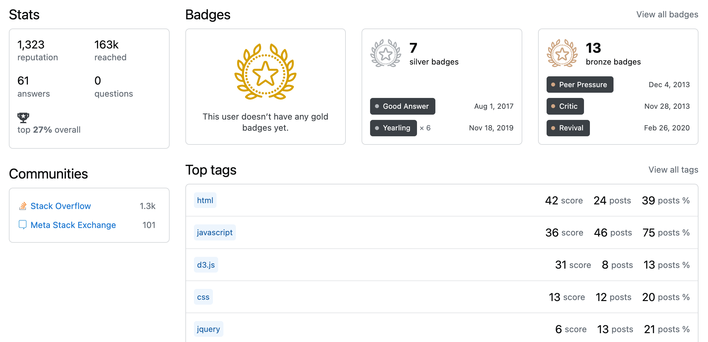

# 开始

十年前为了凑简历，注册了StackOverflow，Reputation刷到1000就闲置了。现注册账号重刷StackOverflow，在这里记录刷题记录。初始账号信息：

旧账号声望截图：

# 徽章(badge)收集计划

用户取得特定成就时StackOverflow会为用户颁发徽章，徽章分为金银铜三种类型：

- 青铜徽章：用于鼓励用户使用网站新功能，相对容易获得。
- 白银徽章：相对于青铜徽章获取难度更高，需要针对性根据徽章要求制定执行策略以获得。
- 黄金徽章：用于奖励对社区有重要贡献的用户，获得难度较高。

## 徽章记录
- <a href="https://stackoverflow.com/help/badges/2600/informed?userid=22510112" target="_blank" class="so-badge so-badge-bronze">Informed</a>: 阅读全部[tour](https://stackoverflow.com/tour)页面。2023-09-06获得。
- <a href="https://stackoverflow.com/help/badges/3/editor?userid=22510112" target="_blank" class="so-badge so-badge-bronze">Autobiographer</a>: 填写个人简介“自我介绍”。2023-12-20获得。
- <a href="https://stackoverflow.com/help/badges/3/editor?userid=22510112" target="_blank" class="so-badge so-badge-bronze">Editor</a>：编辑第一个答案，2023-12-26获得。

# 声望（reputation）获取计划

声望代表你在社区的贡献和地位，声望越高，对应权限越高。

声望获取方式：

- 提问获得一次点赞（voted up）：+10
- 回答获得一次点赞：+10
- 文章获得一次点赞：+10
- 回答被采纳： +15（提问者额外+2）
- 建议的编辑被接受：+2（每用户最多+1000）
- 悬赏奖励给你的回答：+完整的悬赏金额
- 你的回答自动获得了一个悬赏奖励：+悬赏金额的一半
- 站点关联奖励：在每个站点上 +100（每个站点最多奖励一次）。

每天可以通过赞同、反对和建议编辑的组合最多获得200声望分。但悬赏奖励、被接受的回答以及站点关联奖励不受每日声望上限的限制。

声望扣减条款：

- 你的问题被踩（voted down）：−2
- 你的回答被踩：−2
- 你的文章被踩：−2
- 你踩一个他人回答：−1
- 你踩一篇文章：−1
- 你在一个问题上设立了悬赏：−完整的悬赏金额
- 你的帖子收到了6个垃圾或攻击性标记：−100

声望规则总结起来就是：提出高质量问题或者给出高质量回答，通用问题有机会获得更多声望。

## 积分记录

这里只记录有里程碑意义的积分获得时间，比如第一个积分、第一个主动积分、50、100、500、1000等。

- 1：2023-09-06注册获得

# 流水记录

这里记录在StackOverflow的日常和故事。

## 2023-12-20：开启StackOverflow系列文章+第二个徽章

确定开启StackOverflow系列文章，搭建本篇文章作为总结+汇总。

通过填写个人简介“自我介绍”获得<a href="" target="_blank" class="so-badge so-badge-bronze">Autobiographer</a>徽章。

## 2023-12-26：第一个回答+第三个徽章

贡献第一个回答：[Div that expands only upwards and scrolls at max height](https://stackoverflow.com/questions/77712519/div-that-expands-only-upwards-and-scrolls-at-max-height/77714303#77714303)

编辑答案意外获得<a href="https://stackoverflow.com/help/badges/3/editor?userid=22510112" target="_blank" class="so-badge so-badge-bronze">Editor</a>徽章
